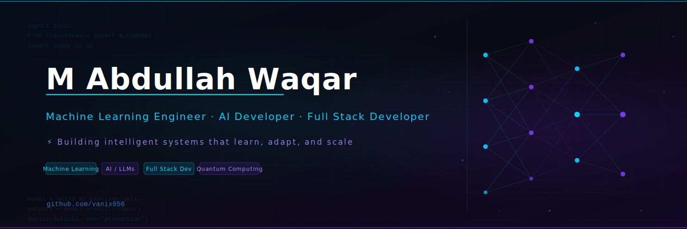

<p align="center">
  
</p>

# Hi, I'm M Abdullah Waqar

**Machine Learning Engineer · AI Developer · Full Stack Developer**

<p>
  
  
  
  
  
</p>

I build intelligent systems that solve real-world problems — from computer vision pipelines and NLP applications to no-code ML platforms and data-driven predictive tools. I'm passionate about bridging the gap between research and production-ready AI.

---

##  Skills

### Machine Learning & AI


- Deep Learning: CNN, RNN, Transformers (BERT, DeepSeek R1)
- Computer Vision: Object Detection, Emotion Recognition, Gesture Control
- NLP: Text Summarization, Sentiment Analysis, Chatbot Development (RAG)
- Quantum Computing: Variational Quantum Eigensolver (VQE), Quantum Chemistry
- AutoML · Model Training Pipelines · Predictive Modelling

### Programming Languages


### Web Development


- REST API design · Express.js · Full Stack application development

### Data Science


- Exploratory Data Analysis · Feature Engineering · Statistical Modelling · Data Visualization

### Tools & Technologies


---

## 🚀 Featured Projects

### [Train-Your-Model](https://github.com/vanix056/Train-Your-Model)
A no-code AutoML platform that lets users upload datasets, configure hyperparameters via a UI, and train machine learning models — no code required. Designed to democratise ML for non-technical users.  
**Tech Stack:** Python, AutoML, FastAPI  
**Highlight:** End-to-end automated training pipeline with configurable model selection

---

### [Log Classification System](https://github.com/vanix056/Log-classification-system)
Intelligent log analysis system that classifies system logs using a hybrid approach combining DeepSeek R1 (LLM), BERT embeddings, and regex-based pattern matching.  
**Tech Stack:** Python, BERT, DeepSeek R1, Regex  
**Highlight:** Leverages state-of-the-art LLMs alongside classical NLP for robust, multi-strategy classification

---

### [Heatwave Risk Prediction](https://github.com/vanix056/Heatwave-Risk-Prediction-for-Major-Pakistani-Cities)
Data-driven analysis and forecasting of heatwave patterns across major Pakistani cities using historical climate data. Provides actionable risk predictions for future periods.  
**Tech Stack:** Python, Pandas, Scikit-learn, Matplotlib  
**Highlight:** Time-series analysis combined with ML-based future prediction for real-world climate impact

---

### [Object Detection (COCO)](https://github.com/vanix056/Object-Detection-COCO)
Real-time multi-object detection using MobileNet SSD trained on the COCO dataset. Optimised for speed and accuracy across diverse object categories in live video feeds.  
**Tech Stack:** Python, TensorFlow, MobileNet SSD, OpenCV  
**Highlight:** Lightweight architecture suitable for deployment on edge devices

---

### [NUST Admissions Guide Chatbot](https://github.com/vanix056/Nust-admissions-guide)
RAG-based LLM chatbot built for a university chatbot competition, answering NUST admissions queries by retrieving answers from institutional knowledge documents.  
**Tech Stack:** Python, LLM, RAG, Vector Embeddings  
**Highlight:** End-to-end retrieval-augmented generation pipeline on a real-world institutional domain

---

### [VQE — Quantum Computing Research](https://github.com/vanix056/VQE)
Research implementation of the Variational Quantum Eigensolver (VQE) to calculate binding energies and ground state energies of molecular systems, developed for the CETQAP research programme.  
**Tech Stack:** Python, Qiskit, VQE, Quantum Chemistry  
**Highlight:** Applied quantum computing research bridging physics, mathematics, and computational science

---

## 📊 GitHub Stats

<p align="center">
  
  
</p>

<p align="center">
  
</p>

---

## 🔭 Current Focus

- Deploying ML models to production using FastAPI and Docker
- Exploring advanced deep learning architectures (Vision Transformers, LLM fine-tuning)
- Building AI-powered full stack applications
- Strengthening system design and scalable backend skills

---

## 💡 Interests

- Applied AI research and ML engineering
- Building scalable, production-ready software systems
- Computer vision and natural language processing
- Open source contribution
- Solving high-impact, real-world problems with data

---

## 📫 Contact

| Platform | Link |
|----------|------|
| GitHub | [@vanix056](https://github.com/vanix056) |
| LinkedIn | [linkedin.com/in/vanix056](https://linkedin.com/in/vanix056) |
| Email | vanix056@gmail.com |

---

<p align="center">
  <i>"Building systems that learn, adapt, and scale."</i>
</p>

---

## 🎨 Banner Design Reference

> The profile banner (`banner.svg`) was custom-built as an SVG and is fully editable.

### AI Image Generation Prompt
```
Ultra-wide 1500x500 px GitHub profile banner for a Machine Learning & AI engineer.
Dark background blending deep navy blue (#050d1a), near-black (#0a0a14), and deep purple (#120826).
Subtle grid overlay. Abstract neural network with glowing cyan (#00d4ff) and purple (#7c3aed)
nodes and connecting lines on the right half. Left side shows clean, modern sans-serif typography:
large bold white name "M Abdullah Waqar", cyan subtitle "Machine Learning Engineer · AI Developer
· Full Stack Developer", and a purple tagline. Faint Python/PyTorch import statements as
decorative code lines. Minimal, professional, tech-forward aesthetic. No stock photos.
```

### Alternative Design Variations
| Variation | Description |
|-----------|-------------|
| **Light Mode** | White/light-grey background with dark navy text and blue-green accents |
| **Neon Noir** | Pure black background, high-contrast hot-pink + cyan neon glow nodes |
| **Ocean Depth** | Teal-to-midnight gradient with bioluminescent particle network |
| **Terminal** | Full green-on-black CRT terminal look with ASCII-art neural net |

### Color Palette
| Role | Color | Hex |
|------|-------|-----|
| Background (start) | Dark Navy | `#050d1a` |
| Background (mid) | Near-Black | `#0a0a14` |
| Background (end) | Deep Purple | `#120826` |
| Primary Accent | Cyan | `#00d4ff` |
| Secondary Accent | Purple | `#7c3aed` |
| Accent (muted) | Lavender | `#a78bfa` |
| Grid Lines | Steel Blue | `#1a2a4a` |
| Body Text | White | `#ffffff` |

### Typography Suggestions
| Use | Font | Weight | Notes |
|-----|------|--------|-------|
| Name / Headline | Segoe UI, Inter, or Poppins | 700 Bold | 60–72 px, slight letter-spacing |
| Subtitle / Titles | Segoe UI, Roboto | 400 Regular | 20–24 px, 2 px letter-spacing |
| Tagline | Segoe UI Light | 300 Light | 16–18 px, 3 px letter-spacing |
| Code decoration | Courier New, JetBrains Mono | 400 | 12–14 px, low opacity |

### Layout Structure
```
┌─────────────────────────────────────────────┬────────────────────┐
│  [code lines — top left, 10% opacity]        │                    │
│                                              │   ●────●           │
│   M Abdullah Waqar  ← 64px Bold White        │  ╱│╲  ╱│           │
│   ━━━━━━━━━━━━━━━━ ← cyan 3px underline     │ ● │ ● │ ●          │
│                                              │  ╲│╱  ╲│           │
│   ML Engineer · AI Dev · Full Stack ← cyan  │   ●────●           │
│   ⚡ Building intelligent systems... ← lilac │                    │
│                                              │  Neural network    │
│   [ML] [AI] [FullStack] [Quantum] ← tags    │  node graph        │
│                                              │  (right ~30%)      │
│  [code lines — bottom left, 10% opacity]    │                    │
│  github.com/vanix056                         │                    │
└─────────────────────────────────────────────┴────────────────────┘
  ← 68% text / branding area →  ← 32% neural net decoration →
```
